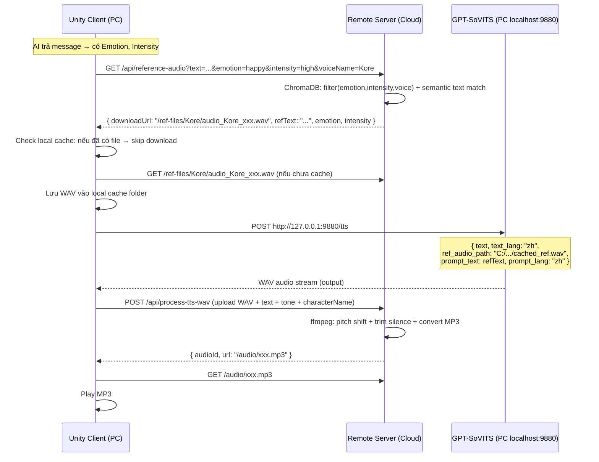

# Triển khai luồng TTS Local (GPT-SoVITS) cho PC — Bản chính thức

## Kiến trúc

```
┌─────────────────────────────────────────────────────────┐
│                   Remote Server (Cloud)                  │
│  Node.js + ChromaDB + reference_index.json + WAV files  │
│  Endpoints: /reference-audio, /process-tts-wav           │
└──────────────────────┬──────────────────────────────────┘
                       │ Internet (HTTP)
┌──────────────────────┴──────────────────────────────────┐
│                     PC User (Local)                      │
│  ┌─────────────┐    ┌──────────────────────────┐        │
│  │ Unity Client │◄──►│ GPT-SoVITS (localhost:9880)│       │
│  └─────────────┘    └──────────────────────────┘        │
│         │ Ref WAV cache: %AppData%/Mimichat/ref_cache/  │
└─────────────────────────────────────────────────────────┘
```

## Flow chi tiết



---

## Proposed Changes

### Component 1: Prompt — Giới hạn cảm xúc + Thêm Emotion/Intensity field

#### [MODIFY] [chat-prompt.service.ts](file:///d:/Unity/UnityTemlet/server/src/services/chat-prompt.service.ts)

1. **Giới hạn emotion palette** chỉ còn 12 cảm xúc chính (bỏ hết emotion phụ):
   ```
   angry, shouting, disgusted, sad, scared, surprised, shy, affectionate, happy, excited, serious, neutral
   ```

2. **Thêm 2 fields mới** vào JSON response format:
   ```json
   {
     "Emotion": "happy",
     "Intensity": "high"
   }
   ```
   - `Emotion`: 1 trong 12 enum (lowercase)
   - `Intensity`: `low` | `medium` | `high`

---

### Component 2: Reference Audio Vector Service

#### [NEW] [reference-audio-vector.service.ts](file:///d:/Unity/UnityTemlet/server/src/services/reference-audio-vector.service.ts)

ChromaDB-backed service để index và query reference audio:

- **`indexAll()`**: Đọc `reference_index.json` → upsert vào ChromaDB collection `reference_audio_index`
  - Document: text field (tiếng Trung)
  - Metadata: `{ voice, emotion, intensity, file }`
  - Embedding: OpenAI `text-embedding-3-small`
  
- **`query(text, emotion, intensity, voiceName)`**:
  1. Filter: `voice == voiceName AND emotion == emotion AND intensity == intensity`
  2. Semantic search bằng `text`
  3. Trả về top match
  4. **Fallback**: Nếu không có kết quả → bỏ text filter, lấy random 1 entry match (emotion, intensity, voice)

---

### Component 3: API Endpoints

#### [MODIFY] [shared.routes.ts](file:///d:/Unity/UnityTemlet/server/src/routes/shared.routes.ts)

```typescript
router.get("/reference-audio", requireAuth, ttsController.getReferenceAudio);
router.post("/process-tts-wav", requireAuth, upload.single('audio'), ttsController.processTtsWav);
```

#### [MODIFY] [tts.controller.ts](file:///d:/Unity/UnityTemlet/server/src/controllers/shared/tts.controller.ts)

**Handler 1: `getReferenceAudio`**
- Input: `?text=...&emotion=happy&intensity=high&voiceName=Kore`
- Logic: Gọi ReferenceAudioVectorService.query()
- Output:
  ```json
  {
    "success": true,
    "reference": {
      "file": "audio_Kore_xxx.wav",
      "text": "今天的天气真的很不错...",
      "emotion": "happy", 
      "intensity": "medium",
      "downloadUrl": "/ref-files/Kore/audio_Kore_xxx.wav"
    }
  }
  ```

**Handler 2: `processTtsWav`**
- Input: multipart form — `audio` (WAV file), `text`, `tone`, `characterName`, `messageId`
- Logic: Resolve pitch/speakingRate → `convertWavToMp3()` → lưu MP3
- Output: `{ audioId, url: "/audio/xxx.mp3" }`

---

### Component 4: Static Serve Reference Files

#### [MODIFY] [index.ts](file:///d:/Unity/UnityTemlet/server/src/index.ts)

```typescript
// Serve reference audio files cho client download
app.use("/ref-files", express.static(path.join(process.cwd(), "data", "dataset_chinese")));
```

---

### Component 5: Database

#### [MODIFY] [voice.entity.ts](file:///d:/Unity/UnityTemlet/server/src/models/voice.entity.ts)
```typescript
export type VoiceModel = "openai" | "gemini" | "gpt-sovits";
```

#### [MODIFY] [character.entity.ts](file:///d:/Unity/UnityTemlet/server/src/models/character.entity.ts)
```typescript
@Column({ type: "varchar", length: 64, nullable: true })
gptSovitsVoiceName?: string | null; // "Kore", "Leda", etc.
```

---

### Component 6: Startup Auto-Index

#### [MODIFY] [index.ts](file:///d:/Unity/UnityTemlet/server/src/index.ts)

Khi server start → index `reference_index.json` vào ChromaDB (chỉ chạy nếu ChromaDB available).

---

## Tóm tắt Files

| File | Action | Mô tả |
|------|--------|-------|
| chat-prompt.service.ts | MODIFY | 12 emotions, +Emotion/Intensity fields |
| reference-audio-vector.service.ts | NEW | ChromaDB index/query |
| shared.routes.ts | MODIFY | +2 routes |
| tts.controller.ts | MODIFY | +2 handlers |
| index.ts | MODIFY | Static serve + auto-index |
| character.entity.ts | MODIFY | +gptSovitsVoiceName |
| voice.entity.ts | MODIFY | +"gpt-sovits" type |

---

## Client Unity (Tóm tắt — để implement phía Unity)

```csharp
// Pseudo-code
if (Application.isPC && character.voiceModel == "gpt-sovits") {
    // 1. Lấy reference info từ server
    var refInfo = await GET("/api/reference-audio?...");
    
    // 2. Download + cache reference WAV
    string localRefPath = GetOrDownloadCachedRef(refInfo.downloadUrl, refInfo.file);
    
    // 3. Gọi GPT-SoVITS local
    var wavBytes = await POST("http://127.0.0.1:9880/tts", new {
        text = message.Text,
        text_lang = "zh",
        ref_audio_path = localRefPath,
        prompt_text = refInfo.text,
        prompt_lang = "zh"
    });
    
    // 4. Upload WAV lên server để xử lý
    var result = await POST("/api/process-tts-wav", wavBytes + metadata);
    
    // 5. Play MP3
    PlayAudio(result.url);
}
```
